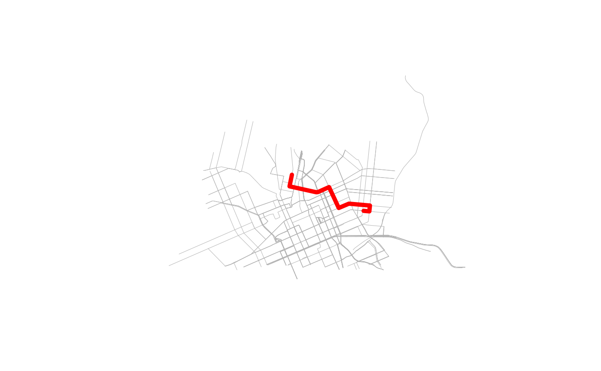

# Quick Start: Install OSRM and calculate routes

``` r
library(osrm.backend)
library(osrm)
```

    ## Data: (c) OpenStreetMap contributors, ODbL 1.0 - http://www.openstreetmap.org/copyright

    ## Routing: OSRM - http://project-osrm.org/

``` r
library(sf)
```

    ## Linking to GEOS 3.12.1, GDAL 3.8.4, PROJ 9.4.0; sf_use_s2() is TRUE

## Create a temporary directory and copy example OSM PBF file into it

``` r
osrm_temp_dir <- file.path(tempdir(), paste0("osrm-data-", Sys.getpid()))
dir.create(osrm_temp_dir, showWarnings = FALSE, recursive = TRUE)
internal_pbf <- system.file("extdata/cur.osm.pbf", package = "osrm.backend")
file.copy(from = internal_pbf, to = osrm_temp_dir)
```

    ## [1] TRUE

## Start local OSRM server

Start the server with
[`osrm_start()`](https://www.ekotov.pro/osrm.backend/reference/osrm_start.md)
function pointing to the temporary directory created above. It will
automatically check if OSRM Backend binaries are installed, and if not,
it will install the latest version, it will also automatically prepare
the routing graph from the OSM PBF file if not already done and start
the server. If any of the steps are unnecessary, it will skip them, so
running this funciton will not lead to re-downloading of OSRM binaries
or re-processing of the OSM PBF file if already done.

``` r
osrm_start(osrm_temp_dir, verbose = TRUE)
```

    ## OSRM backend not found. Installing latest version...

    ## Finding latest stable version with available binaries...

    ## Latest stable version is 'v6.0.0'

    ## Detected platform: linux-x64

    ## Found release: v6.0.0 (v6.0.0)

    ## Found matching binary: node_osrm-v6.0.0-8-linux-x64-Release.tar.gz

    ## Downloading from https://github.com/Project-OSRM/osrm-backend/releases/download/v6.0.0/node_osrm-v6.0.0-8-linux-x64-Release.tar.gz

    ## Extracting binaries...

    ## Installing binaries to /home/runner/.cache/R/osrm.backend/v6.0.0

    ## Fetching Linux TBB runtime components from OSRM release v5.27.1...

    ## Downloading profiles from release tarball...

    ## Extracting profiles...

    ## Installed profiles to /home/runner/.cache/R/osrm.backend/v6.0.0/profiles

    ## Setting executable permissions...

    ## Added '/home/runner/.cache/R/osrm.backend/v6.0.0' to PATH for this session.

    ## Installation successful!

    ## Installation complete.

    ## OSRM graph not found. Preparing graph from 'cur.osm.pbf', this may take a while...

    ## [2025-12-05T15:25:36.357827924] [info] Parsed 0 location-dependent features with 0 GeoJSON polygons
    ## [2025-12-05T15:25:36.357908796] [info] Using script /home/runner/.cache/R/osrm.backend/v6.0.0/profiles/car.lua
    ## [2025-12-05T15:25:36.357933682] [info] Input file: cur.osm.pbf
    ## [2025-12-05T15:25:36.357940655] [info] Profile: car.lua
    ## [2025-12-05T15:25:36.357943912] [info] Threads: 4
    ## [2025-12-05T15:25:36.358109813] [info] Parsing in progress..
    ## [2025-12-05T15:25:36.358299579] [info] input file generated by 0.48.3
    ## [2025-12-05T15:25:36.358387764] [info] timestamp: n/a
    ## [2025-12-05T15:25:36.361245656] [info] Using profile api version 4
    ## [2025-12-05T15:25:36.361437656] [info] Found 3 turn restriction tags:
    ## [2025-12-05T15:25:36.361444749] [info]   motor_vehicle
    ## [2025-12-05T15:25:36.361448507] [info]   motorcar
    ## [2025-12-05T15:25:36.361451372] [info]   vehicle
    ## [2025-12-05T15:25:36.361470017] [info] Parse relations ...
    ## [2025-12-05T15:25:36.369647251] [info] Parse ways and nodes ...
    ## [2025-12-05T15:25:36.375282493] [info] Using profile api version 4
    ## [2025-12-05T15:25:36.378236902] [info] Using profile api version 4
    ## [2025-12-05T15:25:36.381221454] [info] Using profile api version 4
    ## [2025-12-05T15:25:36.432866018] [info] Parsing finished after 0.074725 seconds
    ## [2025-12-05T15:25:36.432926371] [info] Raw input contains 40185 nodes, 6884 ways, and 158 relations, 197 restrictions
    ## [2025-12-05T15:25:36.432953542] [info] Collecting way information on 197 restrictions...ok, after 9.2e-05s
    ## [2025-12-05T15:25:36.433072746] [info] Collecting way information on 0 maneuver overrides...ok, after 4e-06s
    ## [2025-12-05T15:25:36.433103153] [info] Collecting information on 1031 obstacles...ok, after 0.000596s
    ## [2025-12-05T15:25:36.433956755] [info] Sorting used nodes        ... ok, after 0.000224s
    ## [2025-12-05T15:25:36.434205050] [info] Erasing duplicate nodes   ... ok, after 2.4e-05s
    ## [2025-12-05T15:25:36.434247851] [info] Sorting all nodes         ... ok, after 4.3e-05s
    ## [2025-12-05T15:25:36.434312823] [info] Building node id map      ... ok, after 6.2e-05s
    ## [2025-12-05T15:25:36.434396930] [info] Confirming/Writing used nodes     ... ok, after 7.8e-05s
    ## [2025-12-05T15:25:36.434495926] [info] Processed 4712 nodes
    ## [2025-12-05T15:25:36.434504563] [info] Sorting edges by start    ... ok, after 0.000192s
    ## [2025-12-05T15:25:36.434717091] [info] Setting start coords      ... ok, after 0.000281s
    ## [2025-12-05T15:25:36.435019619] [info] Sorting edges by target   ... ok, after 0.000173s
    ## [2025-12-05T15:25:36.435214434] [info] Computing edge weights    ... ok, after 0.000714s
    ## [2025-12-05T15:25:36.435958350] [info] Sorting edges by renumbered start ... ok, after 0.000228s
    ## [2025-12-05T15:25:36.436308316] [info] Writing used edges       ... ok, after 1.5e-05s -- Processed 5460 edges
    ## [2025-12-05T15:25:36.436461584] [info] Collecting node information on 0 maneuver overrides...ok, after 0s
    ## [2025-12-05T15:25:36.436486651] [info] Collecting node information on 197 restrictions...ok, after 8.3e-05s
    ## [2025-12-05T15:25:36.436591999] [info] writing street name index ... ok, after 0.000211s
    ## [2025-12-05T15:25:36.436994714] [info] extraction finished after 0.079059s
    ## [2025-12-05T15:25:36.437943664] [info] Generating edge-expanded graph representation
    ## [2025-12-05T15:25:36.442819254] [info] .
    ##  10% 
    ## .
    ##  20% 
    ## .
    ##  30% 
    ## .
    ##  40% 
    ## .
    ##  50% 
    ## .
    ##  60% 
    ## .
    ##  70% 
    ## .
    ##  80% 
    ## .
    ##  90% 
    ## .
    ##  100%
    ## [2025-12-05T15:25:36.447872054] [info] Node compression ratio: 0.38264
    ## [2025-12-05T15:25:36.447889446] [info] Edge compression ratio: 0.466532
    ## [2025-12-05T15:25:36.449657303] [info]  graph compression removed 1342 annotations of 1655 in 0.000612 seconds
    ## [2025-12-05T15:25:36.449755437] [info] Find segregated edges in node-based graph ...
    ## [2025-12-05T15:25:36.451767371] [info] ok, after 0.002004s
    ## [2025-12-05T15:25:36.451780777] [info] Segregated edges count = 70
    ## [2025-12-05T15:25:36.451785686] [info] Writing nodes for nodes-based and edges-based graphs ...
    ## [2025-12-05T15:25:36.452083685] [info] Geometry successfully removed:
    ##   compressed edges: 5100
    ##   compressed geometries: 16724
    ##   longest chain length: 67
    ##   cmpr ratio: 0.304951
    ##   avg chain length: 3.27922
    ## [2025-12-05T15:25:36.452095627] [info] Removing invalid turn restrictions...removed 0 invalid turn restrictions, after 6e-06s
    ## [2025-12-05T15:25:36.452124582] [info] Removing invalid maneuver overrides...removed 0 invalid maneuver overrides, after 0s
    ## [2025-12-05T15:25:36.452143457] [info] Constructing restriction graph on 149 restrictions...ok, after 1.6e-05s
    ## [2025-12-05T15:25:36.453774427] [info] Generating edge expanded nodes ... 
    ## [2025-12-05T15:25:36.453787812] [info] .
    ##  10% 
    ## .
    ##  20% 
    ## .
    ##  30% 
    ## .
    ##  40% 
    ## .
    ##  50% 
    ## .
    ##  60% 
    ## .
    ##  70% 
    ## .
    ##  80% 
    ## .
    ##  90% 
    ## .
    ##  100%
    ## [2025-12-05T15:25:36.454205485] [info] Expanding via-way turn restrictions ... 
    ## [2025-12-05T15:25:36.454210956] [info] .
    ##  10% 
    ## .
    ##  20% 
    ## .
    ##  30% 
    ## .
    ##  40% 
    ## .
    ##  50% 
    ## .
    ##  60% 
    ## .
    ##  70% 
    ## .
    ##  80% 
    ## .
    ##  100%
    ## [2025-12-05T15:25:36.454288762] [info] Generated 3346 nodes (7 of which are duplicates)  and 5460 segments in edge-expanded graph
    ## [2025-12-05T15:25:36.454387607] [info] Generating edge-expanded edges 
    ## [2025-12-05T15:25:36.454414668] [info] .
    ##  10% 
    ## .
    ##  20% 
    ## .
    ##  30% 
    ## .
    ##  40% 
    ## .
    ##  50% 
    ## .
    ##  60% 
    ## .
    ##  70% 
    ## .
    ##  80% 
    ## .
    ##  90% 
    ## .
    ##  100% 
    ## 
    ## [2025-12-05T15:25:36.467498554] [info] Sorting and writing 0 maneuver overrides...
    ## [2025-12-05T15:25:36.467651961] [info] done.
    ## [2025-12-05T15:25:36.467663363] [info] Renumbering turns
    ## [2025-12-05T15:25:36.467721161] [info] Writing 0 conditional turn penalties...
    ## [2025-12-05T15:25:36.468277565] [info] Generated 5460 edge based node segments
    ## [2025-12-05T15:25:36.468290670] [info] Node-based graph contains 3339 edges
    ## [2025-12-05T15:25:36.468298485] [info] Edge-expanded graph ...
    ## [2025-12-05T15:25:36.468305397] [info]   contains 5517 edges
    ## [2025-12-05T15:25:36.468314144] [info] Timing statistics for edge-expanded graph:
    ## [2025-12-05T15:25:36.468322009] [info] Renumbering edges: 5.9e-05s
    ## [2025-12-05T15:25:36.468335674] [info] Generating nodes: 0.000613s
    ## [2025-12-05T15:25:36.468344240] [info] Generating edges: 0.013926s
    ## [2025-12-05T15:25:36.468460859] [info] Generating guidance turns 
    ## [2025-12-05T15:25:36.468479684] [info] .
    ##  10% 
    ## .
    ##  20% 
    ## .
    ##  30% 
    ## .
    ##  40% 
    ## .
    ##  50% 
    ## .
    ##  60% 
    ## .
    ##  70% 
    ## .
    ##  80% 
    ## .
    ##  90% 
    ## .
    ##  100% 
    ## 
    ## [2025-12-05T15:25:36.483288095] [info] done.
    ## [2025-12-05T15:25:36.483298384] [info] Created 24 entry classes and 463 Bearing Classes
    ## [2025-12-05T15:25:36.483305458] [info] Handled: 127 of 207 lanes: 61.3527 %.
    ## [2025-12-05T15:25:36.483316338] [info] Assigned 6740 turn instruction types:
    ## [2025-12-05T15:25:36.483323472] [info]   new name: 114 (1.69%)
    ## [2025-12-05T15:25:36.483331366] [info]   continue: 341 (5.06%)
    ## [2025-12-05T15:25:36.483339141] [info]   turn: 2685 (39.84%)
    ## [2025-12-05T15:25:36.483346405] [info]   fork: 26 (0.39%)
    ## [2025-12-05T15:25:36.483351344] [info]   end of road: 747 (11.08%)
    ## [2025-12-05T15:25:36.483356353] [info]   (noturn): 648 (9.61%)
    ## [2025-12-05T15:25:36.483361062] [info]   (suppressed): 2165 (32.12%)
    ## [2025-12-05T15:25:36.483366111] [info]   (sliproad): 14 (0.21%)
    ## [2025-12-05T15:25:36.483371191] [info] Assigned 6740 turn instruction modifiers:
    ## [2025-12-05T15:25:36.483375309] [info]   uturn: 283 (4.20%)
    ## [2025-12-05T15:25:36.483379917] [info]   sharp right: 44 (0.65%)
    ## [2025-12-05T15:25:36.483384586] [info]   right: 1791 (26.57%)
    ## [2025-12-05T15:25:36.483389125] [info]   slight right: 195 (2.89%)
    ## [2025-12-05T15:25:36.483394084] [info]   straight: 2637 (39.12%)
    ## [2025-12-05T15:25:36.483398783] [info]   slight left: 189 (2.80%)
    ## [2025-12-05T15:25:36.483403612] [info]   left: 1556 (23.09%)
    ## [2025-12-05T15:25:36.483408381] [info]   sharp left: 45 (0.67%)
    ## [2025-12-05T15:25:36.483415274] [info] Guidance turn annotations took 0.014971s
    ## [2025-12-05T15:25:36.483420654] [info] Writing Intersection Classification Data
    ## [2025-12-05T15:25:36.483617563] [info] ok, after 0.000191s
    ## [2025-12-05T15:25:36.483625629] [info] Writing Turns and Lane Data...
    ## [2025-12-05T15:25:36.483920502] [info] ok, after 0.000289s
    ## [2025-12-05T15:25:36.484258766] [info] Saving edge-based node weights to file.
    ## [2025-12-05T15:25:36.484384101] [info] Done writing. (0.000118)
    ## [2025-12-05T15:25:36.484391355] [info] Computing strictly connected components ...
    ## [2025-12-05T15:25:36.484878138] [info] Found 240 SCC (1 large, 239 small)
    ## [2025-12-05T15:25:36.484890301] [info] SCC run took: 0.000161402s
    ## [2025-12-05T15:25:36.484904638] [info] Building r-tree ...
    ## [2025-12-05T15:25:36.484909197] [info] Constructing r-tree of 5460 segments build on-top of 4712 coordinates
    ## [2025-12-05T15:25:36.485822250] [info] finished r-tree construction in 0.000904 seconds
    ## [2025-12-05T15:25:36.485961371] [info] Writing edge-based-graph edges       ... 
    ## [2025-12-05T15:25:36.486244201] [info] ok, after 0.000274s
    ## [2025-12-05T15:25:36.486252076] [info] Processed 5517 edges
    ## [2025-12-05T15:25:36.486256795] [info] Expansion: 102457 nodes/sec and 72754 edges/sec
    ## [2025-12-05T15:25:36.486261213] [info] To prepare the data for routing, run: ./osrm-partition "/tmp/RtmpBO4akY/osrm-data-8109/cur"
    ## [2025-12-05T15:25:36.488368817] [info] RAM: peak bytes used: 144867328
    ## [2025-12-05T15:25:36.502829075] [info] Computing recursive bisection
    ## [2025-12-05T15:25:36.503076960] [info] Loaded compressed node based graph: 5088 edges, 4712 nodes
    ## [2025-12-05T15:25:36.503201113] [info]  running partition: 128 1.2 0.25 10 1000 # max_cell_size balance boundary cuts small_component_size
    ## [2025-12-05T15:25:36.503435242] [info] Found 2918 SCC (1 large, 2917 small)
    ## [2025-12-05T15:25:36.503445040] [info] SCC run took: 0.000205145s
    ## [2025-12-05T15:25:36.511526962] [info] Full bisection done in 0.007748s
    ## [2025-12-05T15:25:36.511605239] [info] Loaded node based graph to edge based graph mapping
    ## [2025-12-05T15:25:36.513483693] [info] Loaded edge based graph for mapping partition ids: 11022 edges, 3346 nodes
    ## [2025-12-05T15:25:36.513760833] [info] Fixed 2 unconnected nodes
    ## [2025-12-05T15:25:36.513765803] [info] Edge-based-graph annotation:
    ## [2025-12-05T15:25:36.513769239] [info]   level 1 #cells 22 bit size 5
    ## [2025-12-05T15:25:36.513776182] [info]   level 2 #cells 1 bit size 1
    ## [2025-12-05T15:25:36.513779689] [info]   level 3 #cells 1 bit size 1
    ## [2025-12-05T15:25:36.513782854] [info]   level 4 #cells 1 bit size 1
    ## [2025-12-05T15:25:36.515408564] [info] Renumbered data in 0.001621 seconds
    ## [2025-12-05T15:25:36.515710230] [info] MultiLevelPartition constructed in 0.000284 seconds
    ## [2025-12-05T15:25:36.515909003] [info] CellStorage constructed in 0.000191 seconds
    ## [2025-12-05T15:25:36.516553022] [info] MLD data writing took 0.000636 seconds
    ## [2025-12-05T15:25:36.516562790] [info] Cells statistics per level
    ## [2025-12-05T15:25:36.516589069] [info] Level 1 #cells 22 #boundary nodes 445, sources: avg. 12, destinations: avg. 16, entries: 5321 (42568 bytes)
    ## [2025-12-05T15:25:36.516593006] [info] Level 2 #cells 1 #boundary nodes 0, sources: avg. 0, destinations: avg. 0, entries: 0 (0 bytes)
    ## [2025-12-05T15:25:36.516596293] [info] Level 3 #cells 1 #boundary nodes 0, sources: avg. 0, destinations: avg. 0, entries: 0 (0 bytes)
    ## [2025-12-05T15:25:36.516599589] [info] Level 4 #cells 1 #boundary nodes 0, sources: avg. 0, destinations: avg. 0, entries: 0 (0 bytes)
    ## [2025-12-05T15:25:36.516659782] [info] Bisection took 0.013757 seconds.
    ## [2025-12-05T15:25:36.516665232] [info] RAM: peak bytes used: 145698816
    ## [2025-12-05T15:25:36.540767435] [info] Loaded edge based graph: 11022 edges, 3346 nodes
    ## [2025-12-05T15:25:36.541077407] [info] Loading partition data took 0.002426 seconds
    ## [2025-12-05T15:25:36.545479996] [info] Cells customization took 0.004388 seconds
    ## [2025-12-05T15:25:36.545497028] [info] Cells statistics per level
    ## [2025-12-05T15:25:36.545523417] [info] Level 1 #cells 22 #boundary nodes 445, sources: avg. 12, destinations: avg. 16, entries: 5321 (42568 bytes)
    ## [2025-12-05T15:25:36.545527315] [info] Level 2 #cells 1 #boundary nodes 0, sources: avg. 0, destinations: avg. 0, entries: 0 (0 bytes)
    ## [2025-12-05T15:25:36.545530631] [info] Level 3 #cells 1 #boundary nodes 0, sources: avg. 0, destinations: avg. 0, entries: 0 (0 bytes)
    ## [2025-12-05T15:25:36.545533747] [info] Level 4 #cells 1 #boundary nodes 0, sources: avg. 0, destinations: avg. 0, entries: 0 (0 bytes)
    ## [2025-12-05T15:25:36.545536943] [info] Unreachable nodes statistics per level
    ## [2025-12-05T15:25:36.545558994] [info] Unreachable nodes statistics per level
    ## [2025-12-05T15:25:36.545574233] [info] Unreachable nodes statistics per level
    ## [2025-12-05T15:25:36.545587588] [info] Unreachable nodes statistics per level
    ## [2025-12-05T15:25:36.545549286] [warn] Level 1 unreachable boundary nodes per cell: 0.0909091 sources, 0.181818 destinations
    ## [2025-12-05T15:25:36.545568652] [warn] Level 1 unreachable boundary nodes per cell: 0.0909091 sources, 0.181818 destinations
    ## [2025-12-05T15:25:36.545581497] [warn] Level 1 unreachable boundary nodes per cell: 0.0909091 sources, 0.181818 destinations
    ## [2025-12-05T15:25:36.545594671] [warn] Level 1 unreachable boundary nodes per cell: 0.0909091 sources, 0.181818 destinations
    ## [2025-12-05T15:25:36.546061707] [info] MLD customization writing took 0.00046 seconds
    ## [2025-12-05T15:25:36.546437462] [info] Graph writing took 0.000366 seconds
    ## [2025-12-05T15:25:36.546451308] [info] RAM: peak bytes used: 145784832

    ## Graph preparation complete.

    ## Starting OSRM server with graph 'cur.osrm.mldgr'...

    ## OSRM server started successfully (pid 8188, port 5001).

    ## PROCESS 'osrm-routed', running, pid 8188.

> **Tip:** You can check if server is running with
> [`osrm_servers()`](https://www.ekotov.pro/osrm.backend/reference/osrm_servers.md):
>
>     # A tibble: 1 × 7
>       id                                   pid  port algorithm started_at          alive has_handle
>       <chr>                              <int> <int> <chr>     <dttm>              <lgl> <lgl>
>     1 osrm-28034-5001-20251103122904.133 28034  5001 MLD       2025-11-03 00:00:00 TRUE  TRUE
>
> You can kill the server with
> [`osrm_stop()`](https://www.ekotov.pro/osrm.backend/reference/osrm_stop.md)
> or
> [`osrm_stop_all()`](https://www.ekotov.pro/osrm.backend/reference/osrm_stop_all.md)
> if you have started several servers.

## Load spatial data

Load some spatial data from the OSM PBF file to sample points for
routing and plot the street network:

``` r
# read the pbf file with sf
osm_points <- read_sf(internal_pbf, layer = "points")
osm_streets <- read_sf(internal_pbf, layer = "multilinestrings")

set.seed(100)
sampled_points <- osm_points[sample(nrow(osm_points), 2), ]
```

## Calculate route between sampled points

To use [osrm](https://github.com/riatelab/osrm) package with the local
server, you have to set the `osrm.server` option to point to the local
server URL. The default port that
[`osrm_start()`](https://www.ekotov.pro/osrm.backend/reference/osrm_start.md)
uses is `5001`, so the URL will be `http://localhost:5001/`. Then you
can use any [osrm](https://github.com/riatelab/osrm) function as usual,
here we calculate a route between the two sampled points:

``` r
options("osrm.server" = "http://localhost:5001/")
route <- osrm::osrmRoute(loc = sampled_points)
route
```

    ## Simple feature collection with 1 feature and 4 fields
    ## Geometry type: LINESTRING
    ## Dimension:     XY
    ## Bounding box:  xmin: -49.27156 ymin: -25.43082 xmax: -49.25396 ymax: -25.42358
    ## Geodetic CRS:  WGS 84
    ##     src dst duration distance                       geometry
    ## 1_2   1   2     5.55   2.6324 LINESTRING (-49.25534 -25.4...

    Simple feature collection with 1 feature and 4 fields
    Geometry type: LINESTRING
    Dimension:     XY
    Bounding box:  xmin: -49.27156 ymin: -25.43082 xmax: -49.25396 ymax: -25.42358
    Geodetic CRS:  WGS 84
              src dst duration distance                       geometry
    3786_503 3786 503     5.55   2.6324 LINESTRING (-49.25534 -25.4...

## Plot the route on top of the street network

``` r
plot(st_geometry(osm_streets), lwd = 0.5, col = "grey70")
plot(st_geometry(route), col = "red", lwd = 5, add = TRUE)
```



    ## agg_png 
    ##       2


## Stop local OSRM server and cleanup

You can now stop the server:

``` r
osrm_stop()
```

    ## Stopped OSRM server id=osrm-8188-5001-20251205152536.559 (pid 8188, port 5001).

    ## $id
    ## [1] "osrm-8188-5001-20251205152536.559"
    ## 
    ## $pid
    ## [1] 8188
    ## 
    ## $port
    ## [1] 5001
    ## 
    ## $stopped
    ## [1] TRUE

    Stopped OSRM server id=osrm-29557-5001-20251103124028.405 (pid 29557, port 5001).

And remove the temporary directory:

``` r
unlink(osrm_temp_dir, recursive = TRUE)
```
